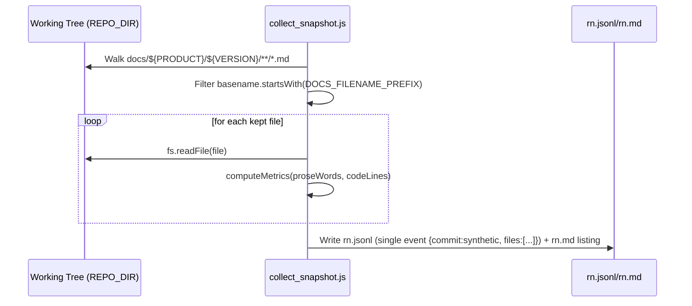
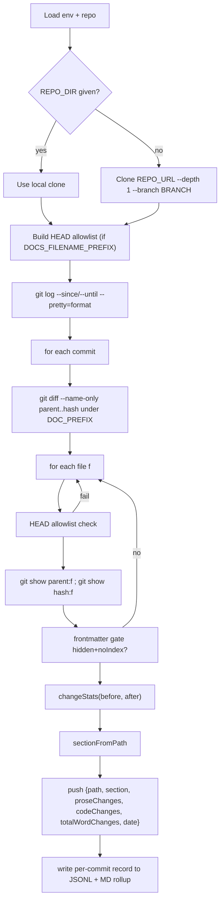
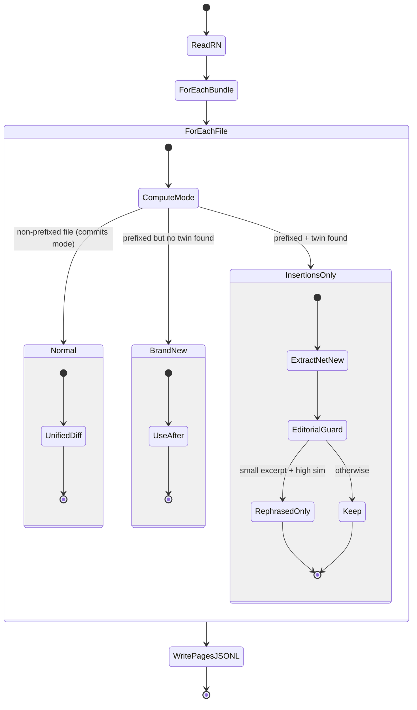
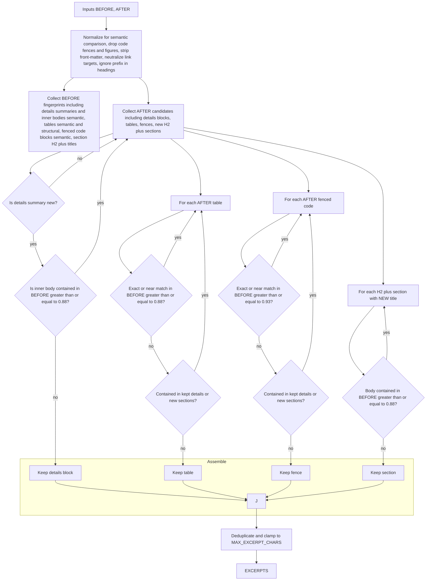
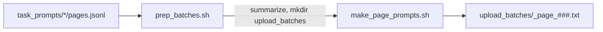
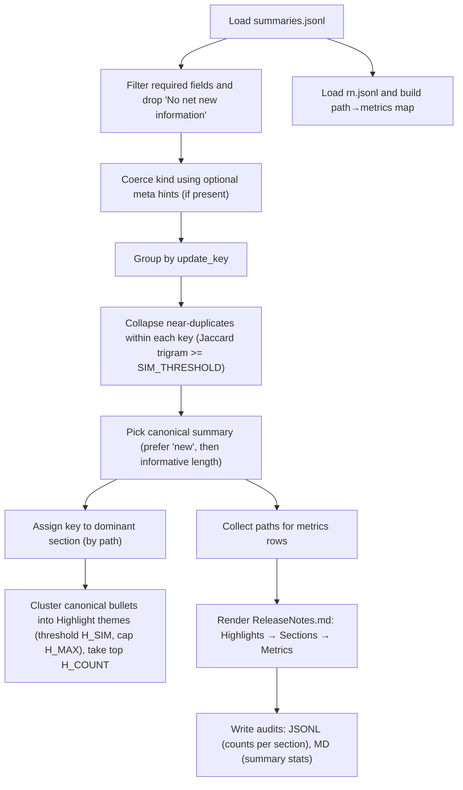
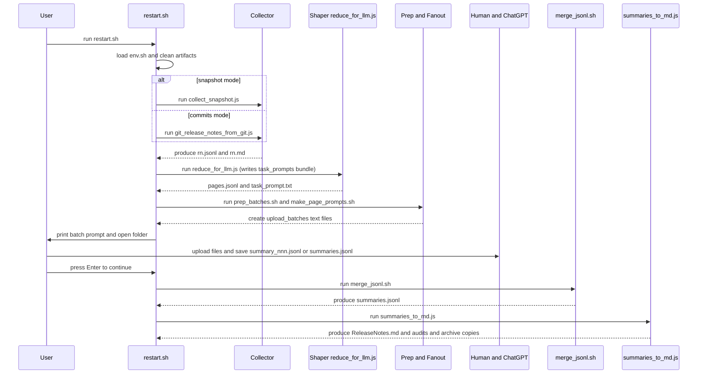

# Gravitee APIM Release Notes Pipeline

## TL;DR

### Prerequisites

Before running the reducer script, ensure you have the following set up:

1. **Node.js Installed**
    - You need Node.js (v18 or later recommended).
    - Verify with: `node -v`
2. **Git Installed**
    - The script interacts with a Git repository, so Git must be installed.
    - Verify with: `git --version`
3. **Cloned Documentation Repository**
    - Clone the documentation repo you want to analyze, for example:

```bash
git clone https://github.com/gravitee-io/gravitee-platform-docs.git
cd gravitee-platform-docs
```

### Execution

```bash
# One-time
chmod +x ./*.sh
source env.sh

# Per run
# rm -rf task_prompts upload_batches llm_tasks.jsonl rn.jsonl summaries.jsonl
./restart.sh
```

---

## Deep Dive

> **Audience:** Senior engineers and doc-ops maintainers who need to understand, extend, or debug the Gravitee release notes generator.
> **Goal:** By reading this guide, you should be able to **re‑implement** the pipeline from scratch, reason about its heuristics, and adjust tunables safely.
> **Scope:** The guide covers the following scripts end‑to‑end, with deep dives, sequence/flow Mermaid diagrams, tunables tables, edge cases, assumptions, and gotchas.

- `env.sh`
- `collect_snapshot.js`
- `git_release_notes_from_git.js`
- `reduce_for_llm.js`
- `prep_batches.sh`
- `make_page_prompts.sh`
- `merge_jsonl.sh`
- `restart.sh` (orchestrator)
- `summaries_to_md.js`

---

### 0) Big‑Picture Overview

#### TL;DR

A reproducible **two‑phase** pipeline:

1. **Collection & Shaping:** Gather candidate doc pages (snapshot or commit window), normalize and **extract only net‑new content**, then emit **per‑page LLM prompts**.
2. **Summarization & Assembly:** Human (or model) returns JSONL summaries → **merge**, **de‑dupe**, and **render** final `ReleaseNotes.md` + audits.

#### High‑Level Flow

```mermaid
flowchart LR
  subgraph Inputs
    A1[env.sh]:::f
    A2[(Git repo)]:::d
  end

  subgraph Phase1[Phase 1 • Collect & Shape]
    B1{COLLECT_MODE}:::g
    B2[collect_snapshot.js]:::s
    B3[git_release_notes_from_git.js]:::s
    B4[rn.jsonl]:::a
    B5[reduce_for_llm.js]:::s
    B6[task_prompts/<bundle>/pages.jsonl<br/>task_prompt.txt<br/>meta.json]:::a
    B7[prep_batches.sh]:::s
    B8[make_page_prompts.sh]:::s
    B9[upload_batches/*.txt]:::a
  end

  subgraph Human[Human/LLM Interaction]
    C1[Upload per‑page files to ChatGPT with batch prompt]:::h
    C2[ChatGPT replies JSON objects - one per line]:::h
    C3[save summary_###.jsonl OR summaries.jsonl]:::h
  end

  subgraph Phase2[Phase 2 • Merge & Finalize]
    D1[merge_jsonl.sh]:::s
    D2[summaries_to_md.js]:::s
    D3[ReleaseNotes.md]:::a
    D4[ReleaseNotes.audit.jsonl]:::a
    D5[ReleaseNotes.audit.md]:::a
  end

  A1 --> B1
  A2 --> B1
  B1 -->|snapshot| B2 --> B4
  B1 -->|commits| B3 --> B4
  B4 --> B5 --> B6 --> B7 --> B8 --> B9 --> C1 --> C2 --> C3
  C3 --> D1 --> D2 --> D3
  D2 --> D4
  D2 --> D5

  classDef f fill:#eef stroke:#777,color:#222
  classDef d fill:#fff6cc,stroke:#b59d00,color:#333
  classDef s fill:#e7f0ff,stroke:#3b82f6,color:#0b3
  classDef a fill:#f5f5f5,stroke:#999,color:#333
  classDef g fill:#d1fae5,stroke:#10b981,color:#065f46
  classDef h fill:#fde68a,stroke:#b45309,color:#7c2d12
```



---

### 1) Environment & Tunables (Global)

#### TL;DR

All scripts read **environment variables** for product/version scoping, date ranges, gating, and formatting. Sensible defaults exist, but **changing thresholds** alters what counts as “net‑new” vs “rephrasing” and how items cluster into highlights.

#### Global Variables (from `env.sh` and used across scripts)

| Variable | Default | Used by | Effect / Behavior | Notes & Gotchas |
| --- | --- | --- | --- | --- |
| `PRODUCT` | `apim` | all JS | Top‑level docs product path segment `docs/${PRODUCT}/${VERSION}` | Mismatch breaks file discovery. |
| `VERSION` | `4.8` | all JS | Second path segment (same as above) | Must match actual docs tree. |
| `REPO_DIR` | `$PWD` | `collect_snapshot.js`, `reduce_for_llm.js` | Filesystem root for working tree | Needs a clean local clone when using snapshot. |
| `BRANCH` | `main` | `git_release_notes_from_git.js` | Git branch for commit scanning | Must exist remotely if cloning. |
| `START_DATE` | unset | `git_release_notes_from_git.js` | Lower bound (inclusive) of commit window (ISO) | Use `YYYY-MM-DD`. |
| `END_DATE` | unset | `git_release_notes_from_git.js` | Upper bound (inclusive) of commit window | Same format as above. |
| `DOCS_FILENAME_PREFIX` | `4.9` | many | **Critical**: filters candidates by filename prefix _and_ controls “twin” logic | Ex: `"4.9"` matches `4.9-*.md`. |
| `COLLECT_MODE` | `snapshot` | `restart.sh`, `reduce_for_llm.js` | Switches Phase 1 source: snapshot vs commits | Snapshot reads working tree; commits diffs parent→hash. |
| `CONTEXT_LINES` | `12` | `reduce_for_llm.js` | Diff context for “normal” pages | Larger values add noise; doesn’t affect insertions‑only. |
| `MAX_EXCERPT_CHARS` | `6000` | `reduce_for_llm.js` | Hard cap on excerpt payload | Prevents runaway prompts. |
| `SKIP_LANGUAGE_ONLY` | `0` | `reduce_for_llm.js` | If `1`, drop likely editorial changes for **normal** mode | Does not apply to insertions‑only/brand‑new. |
| `LANGUAGE_ONLY_THRESHOLD` | `0.35` | `reduce_for_llm.js` | Sensitivity of language‑only heuristic | ↑ stricter (more skipping). |
| `PARALLEL_JOBS` | `4` | `reduce_for_llm.js` | Concurrency for per‑page shaping | Be mindful of I/O bottlenecks. |
| `HIGHLIGHTS_COUNT` | `8` | `summaries_to_md.js` | Max synthesized Highlight bullets | Not 1:1 with updates. |
| `SIM_THRESHOLD` | `0.78` | `summaries_to_md.js` | Jaccard trigram similarity to collapse near‑duplicate summaries under the **same** update_key | ↑ merges more aggressively. |
| `HIGHLIGHT_SIM_THRESHOLD` | `0.62` | `summaries_to_md.js` | Cluster similarity for highlight themes | Tune with caution; affects readability. |
| `HIGHLIGHT_MAX_GROUP` | `6` | `summaries_to_md.js` | Max items absorbed into a theme | Puts a brake on huge clusters. |
| `WRITE_TASK_FILES` | `1` | `reduce_for_llm.js` | Emit `task_prompts/<bundle>` payloads | Set `0` for dry‑run shaping only. |
| `TASK_DIR` | `task_prompts` | `reduce_for_llm.js` | Output folder for bundles | Each bundle = `snapshot` or `<sha7>`. |
| `BATCH_MODE` | `flat_files` | `prep_batches.sh` | Presentational; summary only | Fan‑out happens in `make_page_prompts.sh`. |
| `BATCH_SIZE` | `4` | `prep_batches.sh` | Messaging only | Does **not** throttle generation. |
| `OPEN_UPLOADS` | `1` | `restart.sh`, `prep_batches.sh` | macOS nicety: `open ./upload_batches` | No‑op on Linux. |
| `SUMMARIES_JSONL` | `summaries.jsonl` | `merge_jsonl.sh`, `summaries_to_md.js` | Location of merged LLM results | Can also place a root‑level combined file. |

> **Impact model:** changing thresholds in the reducer (`reduce_for_llm.js`) affects which content the LLM sees at all; changing thresholds in the finalizer (`summaries_to_md.js`) affects how many bullets survive and how they group.

---

### 2) `collect_snapshot.js` — Snapshot Collector

#### TL;DR

Walks `docs/${PRODUCT}/${VERSION}` and **includes only files whose** basename **starts with `DOCS_FILENAME_PREFIX`** (e.g., `4.9-*.md`). Produces a **single synthetic commit** into `rn.jsonl` with basic per‑file metrics measured on the current working tree. Also writes a simple listing (`rn.md`).

#### Sequence & Data



#### What the code does (reverse‑engineering detail)

- **Discovery:** Iterative DFS with `fs.readdir({ withFileTypes:true })`, collecting `*.md` files.
- **Filter:** `path.basename(rel)` must start with `FNAME_PREFIX` (env → `DOCS_FILENAME_PREFIX`, default `"4.9"`).
- **Metrics:** `computeMetrics()` scans lines:
    - Toggle `inFence` when hitting a ````` or `~~~` line.
    - `codeChanges` increments on **non‑empty** lines inside fences **or** 4‑space indented (or TAB) lines.
    - `proseChanges` is **word count** (Unicode‑ish tokenization) for lines outside code.
    - `totalWordChanges = prose + code` (mixed units by design; “bigger change” proxy).
- **Synthetic commit:** `commit.hash = HEAD~short`, `parent = same as hash`, `synthetic=true` (signals snapshot mode downstream). Subject is `[snapshot] <prefix> files in docs/<product>/<version>`.
- **Output:** A **single** JSONL line with `{ commit, files: [...] }` sorted by path for reproducibility.

#### Tunables affecting this stage

- `DOCS_FILENAME_PREFIX` (critical funnel)
- `PRODUCT`, `VERSION`, `REPO_DIR`

#### Gotchas

- **Only the current working tree** is measured — no diffs. That is intentional; “insertions‑only” logic happens later in the reducer.
- Metric units are **heterogeneous** (words vs code lines). The numbers are for **relative** signal in final metrics tables, not strict counts.

---

### 3) `git_release_notes_from_git.js` — Commit‑Window Collector

#### TL;DR

Scans the Git history (optionally date‑bounded) for changes under `docs/${PRODUCT}/${VERSION}/`, but **keeps only pages with the `hidden: true` + `noIndex: true` front‑matter** and additionally gate them by a **HEAD‑aware allowlist** when `DOCS_FILENAME_PREFIX` is set. Emits **one JSONL event per commit**, each containing a compact list of files and **word‑change stats**.

#### Control Flow



#### Key Mechanics & Heuristics

- **HEAD‑aware allowlist** (when `DOCS_FILENAME_PREFIX` is set):
    - Scan **HEAD** files under the docs prefix, bucket by directory.
    - For each file whose **basename starts with the prefix**, add it to `allowed`.
    - Derive a twin by stripping the prefix **from the file’s H1** and look for a **non‑prefixed sibling with the exact same H1** in the **same directory**; add it if found.
    - **Why:** prevents historical renamed variants from leaking in if they don’t exist at HEAD anymore.
- **Front‑matter gate:** `hidden: true` **and** `noIndex: true` must appear in the YAML block at the top of the file **on either side** of the diff (`before` or `after`).
- **Change stats:** A word‑based LCS distance is computed separately for prose and code (after splitting by fenced blocks). Outputs:
    - `proseChanges`, `codeChanges`, `totalWordChanges` (symmetric edit distance in token space).
- **Section extraction:** First folder segment after `docs/${PRODUCT}/${VERSION}/` becomes the “section”.

#### Tunables specific to this script

- `START_DATE`, `END_DATE`, `BRANCH`
- `DOCS_FILENAME_PREFIX` (activates allowlist)
- `REPO_DIR` vs `REPO_URL` (determine local vs ephemeral clone)

#### Gotchas

- The **allowlist is built from HEAD**, so if you change the prefix mid‑run, historical commits not represented at HEAD will be **ignored by design**.
- The **front‑matter requirement** is strict — missing either `hidden` or `noIndex` drops the file. This was chosen to target RN‑staging pages only.

---

### 4) `reduce_for_llm.js` — The Shaper (the hard part)

#### TL;DR

For each candidate page from `rn.jsonl`, generate a **self‑contained prompt** (BEFORE/AFTER/EXCERPTS) tailored to **net‑new content only**. Prefixed pages (`4.9-*.md`) are special: the reducer attempts to locate a **non‑prefixed twin** and then extract **insertions‑only** content to minimize rephrasing noise. The output is a bundle folder with `pages.jsonl` and a helpful `task_prompt.txt` for batch prompting.

#### Modes, Inputs & Outputs



#### Twin Detection (Snapshot vs Commits)

- **Snapshot (`commit.synthetic === true` or `COLLECT_MODE=snapshot`)**
    1. AFTER = working tree file content.
    2. If **basename starts with prefix**:
        - **Same‑folder twin by filename:** remove prefix (with separators `[\s._-]*`) and look for file `<dir>/<basename-without-prefix>`.
        - Else: **H1‑based twin:** strip prefix from H1 in AFTER; scan siblings in same folder that **do not** start with the prefix; pick the one whose first H1 **exactly equals** the stripped title.
        - If twin found ⇒ `mode="insertions-only"`, `BEFORE=twin content`.
        - Else ⇒ `mode="brand-new"`, `BEFORE=""`.
    3. Non‑prefixed files are treated as `brand-new` in snapshot mode (by design).
- **Commits mode**
    - BEFORE = `git show <parent>:<path>`; AFTER = `git show <hash>:<path>`.
    - If basename starts with prefix, try filename twin at **parent**, else H1 twin at **parent**. If found ⇒ insertions‑only with the **twin** as baseline; otherwise brand‑new. Non‑prefixed files ⇒ `mode="normal"` and use unified diff.

#### Insertions‑Only Extraction (core algorithm)

> Produces a **stable “EXCERPTS” block** that contains **only** newly introduced, user‑visible content, in priority order. This is the reduction that keeps the LLM honest.



**Thresholds (all from reducer):**

| Check | Threshold | Meaning |
| --- | --- | --- |
| `containsSemantically(x, BEFORE)` for details body | **0.88** | If most of `x` already existed, drop it. |
| Near‑match tables vs BEFORE tables | **0.88** | Avoid keeping trivially reworded tables. |
| Near‑match fenced code vs BEFORE fences | **0.93** | Code is stricter. |
| New sections containment vs BEFORE | **0.88** | Drop sections that merely rename/move existing content. |
| Containment vs **joined details/sections** | **0.90–0.93** | Prevent duplications between kept blocks. |

**Other structural signals:** new H2/H3+ headings, new tables (>= 3 consecutive `|` lines), new code fences (``` count difference / 2).

#### Editorial/Rephrase Guards (important)

- **Purely editorial skip (insertions‑only only):**
- If **no new headings/tables/fences**, `semanticDelta(BEFORE, AFTER) ≤ 0.06`, and **EXCERPTS prose tokens ≤ 25**, mark as `"purely-editorial"` and **skip** the page.
- **Rephrased‑only skip (insertions‑only only):**
- If `jaccardTrigram(BEFORE, AFTER) ≥ 0.92`, EXCERPTS **prose** tokens `< 25`, and `insertedCode === 0`, treat as **rephrasing**; **skip**.

> These guards are the reason innocuous rewordings do not produce RN churn.

#### Normal Mode (non‑prefixed files in commits mode)

- Use `git --no-pager diff --no-index -U${CONTEXT_LINES}` to compute a unified diff.
- Count only **added lines** to derive `insertedProse/Code` metrics for hinting.

#### Emitted Bundle

- `task_prompts/<bundle>/pages.jsonl`: each line = **one page task**

```
{
  "sha": "<sha7 or 'snapshot'>",
  "path": "docs/.../4.9-foo.md",
  "section": "<top folder>",
  "title": "<H1>",
  "mode": "insertions-only|brand-new|normal",
  "twinPath": "docs/.../foo.md",
  "meta": { "insertedProse": 123, "insertedCode": 7 },
  "content": { "before": "...", "after": "...", "excerpts": "..." },
  "system": "<strict JSONL instructions>",
  "user": "<header + ```BEFORE/AFTER/EXCERPTS``` blocks>"
}
```

- `task_prompts/<bundle>/task_prompt.txt`: per‑bundle wrapper prompt shown to the LLM UI.
- `task_prompts/<bundle>/meta.json`: **commit metadata only** (hash, date, author, subject).
- _(Note: `summaries_to_md.js` tries to read `meta.json.pages[...]` as an optional hint; current reducer does not populate it — harmless.)_

#### Tunables & Practical Impact

| Tunable | Where | Impact |
| --- | --- | --- |
| `DOCS_FILENAME_PREFIX` | twin finder | Changes which files enter insertions‑only mode and how twins resolve (filename vs H1); wrong value ⇒ many pages become `brand-new`. |
| `SMALL_EXCERPT_TOKENS` (=25) | editorial guard | Raise to suppress more tiny insertions; lower to capture micro‑additions. |
| `TINY_DELTA` (=0.06) | editorial guard | Raise to call more low‑delta edits “editorial only”. |
| `jaccardTrigram before/after ≥ 0.92` | rephrase guard | Lowering this will **allow** more “similar” pages to pass; raising suppresses aggressively. |
| `MAX_EXCERPT_CHARS` | clamp | Prevents over‑long prompts; too small may truncate legitimate large inserts. |
| `SKIP_LANGUAGE_ONLY` + `LANGUAGE_ONLY_THRESHOLD` | normal mode only | Avoids generating tasks for diffs that are mostly editorial. |

#### Gotchas & Subtleties

- **H1 twin match is exact.** Any punctuation drift breaks it; that’s why filename twin is tried first.
- **Front‑matter is stripped** for comparisons; otherwise boilerplate YAML changes create false deltas.
- **Neutralizing link targets** (`](#)`) collapses pure path changes in links into no‑ops.
- **Details blocks get first priority**, because they often encapsulate examples/warnings we added during the cycle.
- **Tables detection** requires 3+ table‑like lines (with `|`) — ensures we don’t keep single‑row artifacts.
- **Metrics in pages.jsonl** (`insertedProse/Code`) are **from EXCERPTS**, not entire AFTER, so they reflect _net new_ scale.

---

### 5) `prep_batches.sh` and `make_page_prompts.sh` — Fan‑Out for Upload

#### TL;DR

Discovery + presentation. `prep_batches.sh` summarizes bundles and resets `upload_batches/`. `make_page_prompts.sh` **materializes one `.txt` file per page task**, concatenating the system prompt, mode/twin hints, and the BEFORE/AFTER/EXCERPTS blocks. These are the exact files you upload to ChatGPT.

#### Flow



#### Notable Behaviors

- `make_page_prompts.sh` is **POSIX‑portable** (macOS bash 3.2): no `mapfile`, uses `find -print0` + `while ... read -d ''`.
- Uses `jq` to extract `.system` and `.user` strings from each JSON line; writes a single flat text file per page with:
    1. System instructions
    2. An **extra guidance** heredoc block (immutable rules about `"kind"` defaults by mode)
    3. Mode + Twin single‑line hints
    4. User prompt with fenced BEFORE/AFTER/EXCERPTS
- File naming: `<bundle>_page_001.txt`, `<bundle>_page_002.txt`, …

#### Gotchas

- **CR stripping**: text is normalized with `tr -d '\r'` to avoid macOS CRLF issues.
- If `.system`/`.user` are missing the file is skipped (defensive `jq -e` test).

---

### 6) Human/LLM Round‑Trip + `merge_jsonl.sh`

#### TL;DR

You upload all page files into ChatGPT along with a batch prompt (saved as `upload_batches/BATCH_PROMPT.txt`). ChatGPT returns **one or more JSON objects per page** (one per line). You save these to `upload_batches/summary_###.jsonl` **or** as a single root‑level `summaries.jsonl`. `merge_jsonl.sh` scans, **extracts balanced JSON objects** (even from prose), validates fields, and writes a clean `summaries.jsonl` de‑duplicated set.

#### Merge Mechanics

- Searches inputs in order:
    1. If a root‑level `${SUMMARIES_JSONL}` exists → use it.
    1. Else, find `upload_batches/*.jsonl` (sorted).
- **Cleaning**:
    - `deSmart()` replaces smart quotes/dashes/non‑breaking spaces.
    - `stripFences()` drops and fenced blocks.
- **Robust JSON extraction**: streaming brace‑balancing scanner that tolerates garbage around/inside lines (no regex JSON).
- **Validation**: object must have **string** fields `sha`, `path`, `summary`, `update_key`, `kind` where `kind ∈ {new, updated}` (case‑insensitive).

#### Gotchas

- The merger is **idempotent** and de‑dupes by full JSON line; it keeps **both** lines if semantically identical but with different whitespace inside `summary` — because after normalization strings compare equal inside the writer, not before.
- If nothing valid found, it still creates an empty `${SUMMARIES_JSONL}` to avoid downstream crashes.

---

### 7) `summaries_to_md.js` — Finalizer & Highlight Synthesizer

#### TL;DR

Consumes `summaries.jsonl` (LLM outputs) and `rn.jsonl` (for metrics). Groups by `update_key`, **collapses near‑duplicate summaries per key**, chooses a **canonical bullet** for each key, synthesizes **thematic Highlights** by clustering bullets, injects a **Modified Pages** metrics table, and writes outputs: `ReleaseNotes.md` + compact audits.

#### Processing Pipeline



#### Similarity & Clustering Tunables

| Variable | Default | Where | Effect |
| --- | --- | --- | --- |
| `SIM_THRESHOLD` | `0.78` | Collapse per `update_key` | Higher = more aggressive dedupe (fewer bullets per key). |
| `HIGHLIGHT_SIM_THRESHOLD` | `0.62` | Theme clustering | Higher = fewer, tighter highlight themes. |
| `HIGHLIGHT_MAX_GROUP` | `6` | Theme clustering | Prevents mega clusters; extra items spawn new themes. |
| `HIGHLIGHTS_COUNT` | `8` | Final output | Caps the number of highlights rendered. |

#### Canonicalization Strategy

- Score each candidate summary with: `score = 2*(kind==='new') + min(1, len/300)`; tie‑break by `path`, then `sha`.
- → favors **new** items and reasonably descriptive text without rewarding verbosity.

#### Metrics Injection

- `rn.jsonl` supplies per‑path `{prose, code, total}` (from collectors). Finalizer adds rows **only for pages that appear in the detailed bullets**, keeping the table relevant.

#### Gotchas

- **Optional meta hints:** `summaries_to_md.js` attempts to load `task_prompts/*/meta.json` and read a non‑existent `pages` array to coerce `"kind"`. This path is **safe** (try/catch + guard); current reducer only writes commit meta. If you later extend `meta.json` with page hints, the coercion logic already exists.
- If `summaries.jsonl` is missing, it writes a minimal Release Notes file with a warning and exits gracefully.

---

### 8) `restart.sh` — Orchestrator

#### TL;DR

One‑button, reproducible runs. Cleans prior artifacts, executes collection (snapshot or commits), reduction, batch prep, fan‑out, pauses for human upload/merge, then finalizes artifacts and archives them with timestamps.

#### Orchestration Steps



#### Safety & UX touches

- **Safe cleanup** deletes only known paths (and only if they exist). `DEEP_CLEAN=1` also removes the collector outputs to force a full rebuild.
- Prints a **prompt file** (`upload_batches/BATCH_PROMPT.txt`) and copies it to clipboard on macOS (`pbcopy`) for convenience.
- Archives final outputs under `rn_docs/ReleaseNotes_*` with a timestamp.

---

### 9) Data Contracts & File Formats

#### `rn.jsonl` (collectors)

- **Snapshot**: single line with `synthetic: true` and `files: [{path, proseChanges, codeChanges, totalWordChanges}]` where metrics are measured on AFTER only.
- **Commits**: many lines (one per commit), each with `commit{hash,parent,date,author,subject}`, `files:[{path,section,proseChanges,codeChanges,totalWordChanges,date}]`, and per‑commit totals.

#### `task_prompts/<bundle>/pages.jsonl`

- Each line is a **complete LLM task** (see reducer section). Consumers (`make_page_prompts.sh`, notebooks, etc.) treat it as the **single source of truth** for what to upload.

#### LLM Output JSONL (per line)

```
{
  "sha": "a1b2c3d",
  "path": "docs/apim/4.8/.../4.9-foo.md",
  "summary": "Two–four sentences describing user impact (include 'breaking' if needed).",
  "update_key": "what-changed-slug",
  "kind": "new"              // or "updated"
}
```

> **Invariant:** `update_key` is a **semantic** slug of WHAT changed (stable across pages), not a page title.

#### Final Outputs

- `ReleaseNotes.md`: Highlights → Sections (with **"New" / "Updated" badges**) → Modified Pages (metrics table).
- `ReleaseNotes.audit.jsonl`: one line per section with counts.
- `ReleaseNotes.audit.md`: summary numbers (sanity for pipelines).

---

### 10) Edge Cases the Pipeline Handles

| Case | Where handled | Mechanism |
| --- | --- | --- |
| **Rephrasing only** on prefixed pages | reducer | `rephrased-only` guard (`jaccardTrigram ≥ 0.92` and tiny prose) drops task |
| **Minor editorial fixes** | reducer | `purely-editorial` guard: no new structures + tiny delta + ≤25 tokens |
| **Renamed “versioned” pages** | reducer | Filename twin first, then H1 twin in same folder |
| **Historical rename noise** | commit collector | HEAD‑allowlist + twin logic prevents outdated names from leaking |
| **YAML front‑matter churn** | reducer | Strips front‑matter for semantic comparisons |
| **Link target path changes only** | reducer | Neutralizes link URLs → `](#)` so they don’t count as new content |
| **Tables/Fences duplicated inside kept <details>/<sections>** | reducer | Containment checks vs joined details/sections before emitting |
| **Windows CRLF artifacts** | batch fan‑out | `tr -d '\r'` and robust merging |
| **LLM replies wrapped in prose or code fences** | merge script | brace‑balanced JSON extractor + fence stripper |
| **Missing / empty summaries.jsonl** | finalizer | Writes minimal RN and exits cleanly |
| **Overlong pages** | reducer | `MAX_EXCERPT_CHARS` clamps EXCERPTS |
| **Non‑prefixed files in snapshot mode** | reducer | Treated as `brand-new` by design (no twin) |

---

### 11) Preconditions & Reliability Criteria

For **correct and consistent execution**:

1. **Repository layout:** `docs/${PRODUCT}/${VERSION}/**/*.md` must exist, and versioned RN pages must use the **filename prefix** convention (e.g., `4.9-*.md`).
2. **Node & Git:** Node.js ≥ 16 and Git installed on `PATH`.
3. **`jq` installed** (used by `make_page_prompts.sh`).
4. **Commit collector only:** the HEAD branch must be fetchable (for allowlist) and the date window must be valid.
5. **Front‑matter RN staging:** Pages intended for commit collector must include both `hidden: true` and `noIndex: true`.
6. **Permissions:** Scripts need read/write access in the working directory (create `task_prompts/`, `upload_batches/`, `rn_docs/`).
7. **LLM Outputs:** Each JSON line must include **all required fields** with non‑empty strings; `kind` must be `new` or `updated`.

---

### 12) Assumptions (Design Contracts)

- RN pages follow a **version‑prefixed file naming** scheme (`<prefix>-<slug>.md`) and share a **non‑prefixed twin** with the **same H1** in the **same folder**.
- A **new page** for a release is introduced as a **prefixed** file; the non‑prefixed twin is the “baseline” documentation.
- Rephrasing and layout noise are **not** release‑note worthy; **new structures** (headings, tables, code, details) are.
- The LLM agent will return **valid JSON** when instructed and can handle **multiple objects** (one per line).
- “Highlights” are **themes** across multiple bullets, not a 1:1 mapping.
- The working tree is **clean** enough that snapshot reads reflect intended state.

---

### 13) Troubleshooting Guide (“Gotchas” Recap)

1. **“Why did my new content not appear?”**
    - Check if it’s only rewording; the editorial/rephrase guards may have suppressed it.
    - Ensure it’s a **new H2+** section, a **new `<details>`**, a **new table**, or a **new code fence** for the reducer to capture it.
2. **“Twin not found; page treated as brand‑new.”**
    - Confirm the **H1 without prefix** exactly matches the non‑prefixed sibling’s H1.
    - Check filename twin path (`<dir>/<basename-without-prefix>`).
    - Verify the file lives in the **same directory**.
3. **“Merged highlights feel off.”**
    - Adjust `HIGHLIGHT_SIM_THRESHOLD` (↑ tighter, ↓ looser) and `HIGHLIGHTS_COUNT`.
    - Inspect `ReleaseNotes.audit.jsonl` to see section distribution.
4. **“Summaries missing or malformed.”**
    - Run `./merge_jsonl.sh` again and inspect console for `WROTE=N`.
    - Open the raw `.jsonl` files to ensure objects aren’t inside triple backticks (the merger strips them, but check fields).
5. **“It skipped my commit.”** _(commit collector)_
    - Ensure the changed page has `hidden: true` **and** `noIndex: true`.
    - If using `DOCS_FILENAME_PREFIX`, verify the file (or its twin) exists at **HEAD**.
6. **“Metrics table shows 0s.”**
    - Those numbers come from collectors; snapshot counts words/lines **at HEAD**, not diffs. Commits mode reports LCS deltas per commit. Ensure the path is present in summaries for the row to appear.

---

### 14) Reverse‑Engineering Notes (Why each choice was made)

- **Trigram Jaccard** is a good proxy for **semantic similarity** that tolerates light re‑phrasing but flunks major insertions. Different thresholds (0.92 vs 0.78 vs 0.62) map to **three tiers**: rephrase guard, same‑key dedupe, highlight theming.
- **Details → Tables → Fences → New Sections** priority reflects typical RN authoring patterns: collapsible details often carry the instructive net additions, followed by structured artifacts; we emit sections last to avoid echoing content already captured inside details.
- **Neutralize link targets** so mass link rewrites (e.g., `applications.md` → `4.9-applications.md`) don’t trigger “new content” flags.
- **HEAD allowlist** was introduced after discovering older renamed files kept polluting commit windows when only the prefixed variant matters for RN.
- **Strict JSON Lines** and **no arrays** make merging and downstream processing trivial under version control.

---

### 15) Quick Start (Happy Path)

1. Edit `env.sh` with your `PRODUCT`, `VERSION`, and (if commits mode) `START_DATE/END_DATE` and `DOCS_FILENAME_PREFIX`.
2. Run: `./restart.sh`
    - Choose `COLLECT_MODE=snapshot` (default) or export `COLLECT_MODE=commits` beforehand.
3. Upload files from `upload_batches/` to ChatGPT using the printed prompt; save replies to `upload_batches/summary_*.jsonl` or combine into a root `summaries.jsonl`.
4. Press **Enter** back in the terminal to let the orchestrator **merge** and **finalize**.
5. Open `ReleaseNotes.md`, `ReleaseNotes.audit.*`, and the archived copies under `rn_docs/`.

---

### 16) Full Tunables Matrix (by script)

| Script | Variable | Default | Type | Range/Values | Effect |
| --- | --- | --- | --- | --- | --- |
| collect_snapshot.js | `DOCS_FILENAME_PREFIX` | `4.9` | string | any | Filename filter for included pages |
| collect_snapshot.js | `REPO_DIR` | `$PWD` | path | existing dir | Working tree root |
| git_release_notes_from_git.js | `START_DATE`/`END_DATE` | — | ISO date | `YYYY-MM-DD` | Date window for commits |
| git_release_notes_from_git.js | `DOCS_FILENAME_PREFIX` | `""` | string | any | Activates HEAD allowlist |
| git_release_notes_from_git.js | `REPO_DIR`/`REPO_URL` | — | path/url | — | Local vs ephemeral clone |
| reduce_for_llm.js | `COLLECT_MODE` | `snapshot` | enum | `snapshot`/`commits` | Switches BEFORE/AFTER strategy |
| reduce_for_llm.js | `CONTEXT_LINES` | `12` | int | ≥0 | Size of unified diff context for normal pages |
| reduce_for_llm.js | `MAX_EXCERPT_CHARS` | `6000` | int | ≥1000 | Hard cap for EXCERPTS payload |
| reduce_for_llm.js | `SKIP_LANGUAGE_ONLY` | `0` | bool | 0/1 | Skip normal-mode language‑only edits |
| reduce_for_llm.js | `LANGUAGE_ONLY_THRESHOLD` | `0.35` | float | 0..1 | Sensitivity for language‑only heuristic |
| reduce_for_llm.js | `PARALLEL_JOBS` | `4` | int | ≥1 | Concurrency for shaping |
| summaries_to_md.js | `SIM_THRESHOLD` | `0.78` | float | 0..1 | Per‑key dedupe similarity |
| summaries_to_md.js | `HIGHLIGHT_SIM_THRESHOLD` | `0.62` | float | 0..1 | Highlight theme clustering |
| summaries_to_md.js | `HIGHLIGHT_MAX_GROUP` | `6` | int | ≥1 | Max members per highlight theme |
| summaries_to_md.js | `HIGHLIGHTS_COUNT` | `8` | int | ≥0 | Max highlights rendered |
| restart.sh | `DEEP_CLEAN` | `0` | bool | 0/1 | Remove collector outputs too |
| restart.sh | `OPEN_UPLOADS` | `1` | bool | 0/1 | macOS folder open nicety |

---

### 17) Appendix — Pseudocode for the Tricky Bits

#### A) Insertions‑Only `insertedOnly(before, after)` (abridged)

```
normalize() = stripFrontMatter; drop <figure>; neutralize links; ignore prefix in headings
semantic(x) = lowercase, collapse whitespace, drop code, punctuation

beforeSummaries = set( summaries of <details> in BEFORE )
beforeDetailBodiesSem = [ semantic(innerBodyWithoutSummary) for each details in BEFORE ]

for each details block in AFTER:
  if summary already in beforeSummaries: skip
  bodySem = semantic(innerBodyWithoutSummary)
  if any jaccard3(bodySem, bd) >= 0.85: skip
  if containsSemantically(bodySem, BEFORE) >= 0.88: skip
  keep block

Perform similar loops for tables (near-match ≥0.88) and code fences (≥0.93),
excluding anything already contained in kept details/sections.

For H2+ sections: only keep sections whose **titles are new** vs BEFORE,
and whose bodies are not contained in BEFORE (≥0.88).

Finally, dedupe structurally and clamp total characters to MAX_EXCERPT_CHARS.
```

#### B) Editorial & Rephrase Guards

```
purelyEditorial = (newHeads==0 && newTables==0 && newFences==0 &&
                   semanticDelta(before, after) <= 0.06 &&
                   excerptProseTokens <= 25)

rephrasedOnly = (jaccardTrigram(before, after) >= 0.92 &&
                 excerptProseTokens < 25 &&
                 insertedCode == 0)
```

---

### 18) Versioning & Portability Notes

- Works on macOS and Linux shells; Windows via WSL recommended.
- Node scripts avoid external NPM deps; pure `fs`, `child_process`, `path` etc.
- Mermaid diagrams in this guide render in Slab and GitHub (enable Mermaid).

---
