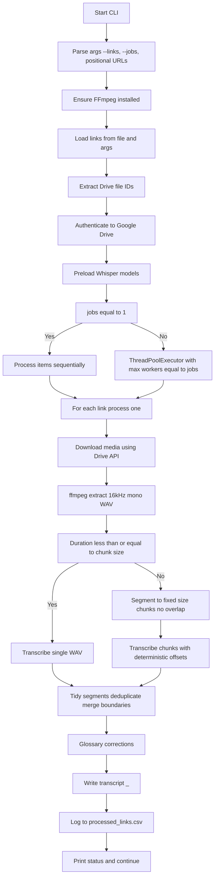
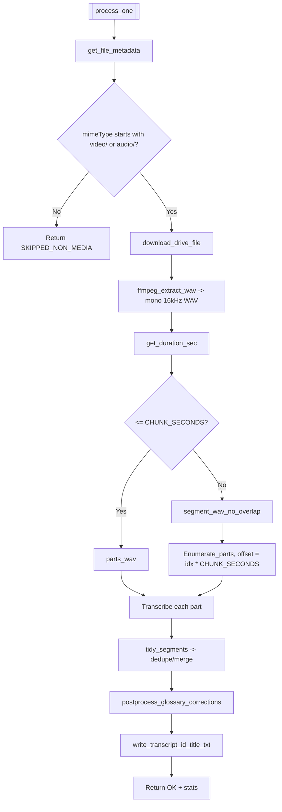

# Transcriber Script Detailed Breakdown.md

This document explains **what your script does**, **why each stage exists**, and **how the pieces fit together**. It’s organized into bite‑sized sections that map to the main functions and logic in your code. Flowcharts (Mermaid) illustrate the high‑level flow and the per‑file pipeline.

> Script filename assumed: `transcribe_from_links.py` 

---

## 1) Big Picture (What & Why)

**Goal:** Take a list of Google Drive links to media files (video or audio), download each file, extract/convert audio to mono 16 kHz WAV, split long audio into fixed-size chunks, run **faster‑whisper** (CTranslate2 backend) with a Gravitee‑aware initial prompt, **fix boundary issues** (duplicate/overlapping segments), and save a clean transcript to a local `.txt` file. Also log each item in `processed_links.csv`.

**Why this design?**

- Operates directly on links (no need to curate a Drive folder).
- Graceful auth via OAuth (`credentials.json` → `token.json`).
- Robustness: retry wrappers, backend auto‑detection, CPU fallbacks.
- Accuracy + readability: domain glossary prompt, de‑duplication, chronological stitching.
- Performance: local model cache, preloading, chunked transcription, configurable parallelism.

---

## 2) High‑Level Flow

---

## 3) Configuration & Environment Variables

**Key variables (top of script):**

- `SCOPES`: Drive **readonly** scope (least privilege for download).
- `REQUESTED_DEVICE`, `REQUESTED_COMPUTE`: user’s preferred backend (e.g., `cpu/int8`).
- `DEFAULT_MODEL` / `FALLBACK_MODEL`: e.g., `medium.en` for < 1 hr; `small.en` otherwise.
- `CHUNK_SECONDS`: default **600s** (10 min). Limits model context + memory footprint.
- `DEFAULT_THREADS`: baseline CPU threads if not overridden.
- `DOWNLOAD_ROOT`: persistent model cache directory (`models`).
- `BEAM_SIZE`: decoding beam width (trade‑off: accuracy vs speed).
- `OUT_DIR`: where transcripts are written (defaults to `.`).
- `LOG_CSV`: per‑run append‑only log (`processed_links.csv`).
- Thresholds for speech/noise filtering & compression: `NO_SPEECH_THRESHOLD`, `LOGPROB_THRESHOLD`, `COMPRESSION_RATIO_THRESHOLD`.

**Why:** All of these can be tuned without editing code. For example:

- Lower `CHUNK_SECONDS` if memory is tight; increase if you want fewer context resets.
- Use `FW_MODEL=small.en` for faster CPU runs; switch to `medium.en` for accuracy.

---

## 4) Backend Resolution (Fix A)

**Function:** `_resolve_backend()`

**Purpose:** Decide final `(device, compute_type)` pair based on **what CTranslate2 actually supports on this machine**.

**Behavior:**

- If `ctranslate2` import fails → force `cpu/int8`.
- Otherwise, query `ctranslate2.get_supported_compute_types(device)` for `cuda`, `metal`, `cpu`.
- If the requested pair isn’t supported, pick the **best available** for that device (e.g., `float16` on GPU; `int8` on CPU).
- Fall back to `cpu/int8` if needed and emit a helpful banner in `main()`.

**Why:** Prevents “my machine doesn’t support Metal/CUDA” crashes and ensures a compatible, fast configuration.

---

## 5) Link Parsing & Drive ID Extraction

**Functions:** `parse_links_from_file()`, `extract_drive_id()`

- **Input:** `links.txt` plus any positional URLs.
- **Work:** Strip comments/blank lines; use regex to extract Drive file IDs from typical URL formats (or accept raw IDs).
- **Why:** Normalizes diverse Drive URL shapes to a consistent `fileId` string; rejects malformed links early.

---

## 6) OAuth Authentication & Token Refresh

**Function:** `authenticate()`

- Uses `credentials.json` to trigger browser auth on first run.
- Saves `token.json` (refreshable) for future runs.
- Detects `invalid_scope` issues and **re‑authorizes** by deleting stale token.
- Returns an authenticated Drive **service** object.

**Why:** Sane UX + least friction after first consent; resilient to token expiry / scope drift.

---

## 7) Drive I/O with Retries

**Decorated by:** `@with_retries()`

- **`get_file_metadata()`**: queries name, mimeType, size.
- **`download_drive_file()`**: fetches bytes; appends `acknowledgeAbuse=true` to support Drive’s “large/unsafe” files prompt; streams to a temp file via `MediaIoBaseDownload` (chunked).

**Why:** Drive intermittently returns 403/5xx; retries with exponential backoff improve success rate.

---

## 8) Audio Extraction & Chunking

**Functions:** `ensure_ffmpeg()`, `ffmpeg_extract_wav()`, `get_duration_sec()`, `segment_wav()`

- **Extraction:** Convert any input to **mono 16 kHz PCM WAV** (`pcm_s16le`) — best for speech models.
- **Duration:** Read WAV header to decide if chunking is needed.
- **Chunking strategy:** **No overlap** fixed segments (e.g., 10 min each) to prevent duplicate time windows at boundaries.

**Why:** Ensures consistent audio format; splits long files to avoid context overflow and keep memory bounded.

**Note:** “No overlap” is crucial because we **manually offset** timestamps per chunk (see §10).

---

## 9) Domain Context & Post‑Corrections

**Functions:** `load_glossary_text()`, `postprocess_glossary_corrections()`

- **Initial prompt:** Short Gravitee glossary (APIM, AM, Kafka, MQTT, OIDC, etc.) nudges the decoder toward correct jargon.
- **Postpass corrections:** Light regex fixes for common ASR misspellings (e.g., “gravity” → “Gravitee”, “open api” → “OpenAPI”).

**Why:** Domain adaptation boosts accuracy and readability without retraining.

---

## 10) Model Loading & Caching

**Functions:** `_create_model()`, `get_model()`

- Cached in `_MODEL_CACHE` keyed by model name.
- Uses the **resolved** backend + threads.
- If model init fails on the resolved backend, retries once on `cpu/int8`.
- Models are stored under `DOWNLOAD_ROOT` to avoid repeated downloads.

**Why:** Saves time on multi‑file runs; avoids repeated large downloads; robust to backend quirks.

---

## 11) Transcription Parameters (Decoding Hints)

**Function:** `transcribe_chunk()`

Parameters used:

- `language="en"`: fixes language to English for stability.
- `temperature=0.0`: deterministic decoding (reduce randomness).
- `beam_size=BEAM_SIZE`: widen search to improve accuracy (trade‑off speed).
- Thresholds: `compression_ratio_threshold`, `log_prob_threshold`, `no_speech_threshold`.
- `condition_on_previous_text=False`: treat each chunk independently (prevents context drift across segments).
- `vad_filter=True`: basic voice‑activity gating.
- `initial_prompt=<glossary>`: domain priming.
- **Offset application:** When called from `process_local_wav`, we pass an `offset` equal to `chunk_index * CHUNK_SECONDS` so timestamps are strictly **monotonic** and **global**.

**Why:** Deliberately stable settings for technical speech; deterministic offsets guarantee chronological transcripts.

---

## 12) Boundary Hygiene (Duplicates & Stitching)

**Functions:** `_similar()`, `tidy_segments()`

- Sorts all segments by `(start,end)`.
- If a new segment starts **very close** to the previous end (≤ `tol` = 0.25s), merge text and extend the end time.
- Drops **near‑duplicate** lines with nearly identical time ranges and very similar text (simulated quick similarity).

**Why:** Eliminates “half‑sentences” and duplicate lines caused by chunk edges or VAD readjustments; results in a clean, linear transcript.

---

## 13) Output Formatting & Naming

**Functions:** `write_transcript()`, `process_one()`

- Output file name: `"<file_id>_<safe_title>.txt"` — makes mapping back to the original Drive link trivial.
- Timestamps printed with **millisecond precision** (`[s.eee - e.eee]`).
- `processed_links.csv` appends one row per item: start time, file_id, title, url, status, duration, size, elapsed seconds, and the transcript filename.

**Why:** Deterministic filenames simplify cross‑referencing the transcript with the original Drive file; CSV helps audit/restart.

---

## 14) Per‑File Pipeline

---

## 15) Parallel Execution & Threading (Fix C)

**Where:** `main()`

- `--jobs` controls **how many files** transcribe **at the same time** (ThreadPoolExecutor).
- Per‑job threads: `FW_THREADS = max(2, (os.cpu_count() or 8) // jobs)` set **once** before models are loaded.
- Whisper’s `cpu_threads` uses this value when creating the model.

**Why:** Prevents over‑subscription. With multiple jobs, each model instance uses fewer CPU threads so the machine remains responsive and total throughput improves.

> Tip: On CPU‑only laptops, `--jobs 1..2` is typically best. Use `FW_MODEL=small.en` for speed or `medium.en` for accuracy.

---

## 16) Error Handling, Retries, and Status Messages

- `with_retries()` wraps Drive API calls for resilience.
- Non‑media or forbidden downloads are **skipped** but logged.
- Exceptions within a worker return a tuple like `("ERROR", ..., str(e))` — still logged to CSV.
- Friendly console banners indicate backend (`cpu/int8`, etc.), jobs, and per‑file outcomes.

**Why:** A long batch shouldn’t die because one item fails. The CSV provides a restart plan.

---

## 17) Extending the Script

- **Speaker diarization:** integrate a diarizer (e.g., pyannote) to attribute speakers, then weave speaker tags into `rows_all`.
- **JSON/TSV output:** add `write_json()` or `write_tsv()` to emit richer metadata (segment confidences, etc.).
- **Custom glossary:** point `FW_GLOSSARY` to your own terms (one per line).
- **Model policy:** pick by duration or by file type; e.g., use `large-v3` for short “hero” clips only.

---

## 18) What Each Major Function Does (Quick Index)

- **`_resolve_backend()`** — Pick compatible device/compute.
- **`parse_links_from_file()` / `extract_drive_id()`** — Normalize Drive links → IDs.
- **`authenticate()`** — OAuth flow; create Drive client.
- **`get_file_metadata()` / `download_drive_file()`** — Drive metadata + streaming download (with retries).
- **`ffmpeg_extract_wav()`** — Convert any media → mono 16 kHz WAV.
- **`segment_wav()`** — Split long WAV into fixed‑length chunks without overlap.
- **`get_model()`** — Build & cache faster‑whisper model with fallbacks.
- **`transcribe_chunk()`** — Run ASR with glossary prompt; apply chunk offset.
- **`tidy_segments()`** — Merge tiny gaps & drop near duplicates at boundaries.
- **`postprocess_glossary_corrections()`** — Fix common domain typos.
- **`write_transcript()`** — Save `[start - end] text` with ms precision.
- **`process_one()`** — Orchestrate per‑file pipeline; return status + stats.
- **`log_processed()`** — Append CSV row for audit/resume.
- **`main()`** — CLI, concurrency, banners, final summary.

---

## 19) Why Timestamps Are Now Strictly Monotonic

- **Chunking without overlap** + **deterministic per‑chunk offsets** (`idx * CHUNK_SECONDS`) means every segment gets a **global time**.
- **tidy_segments** removes duplicates and merges near‑touching segments, preventing repeated time ranges.
- Final sort by `(start, end)` guarantees a readable, chronological transcript.

---

## 20) Defaults You Can Depend On

- Works on CPU‑only laptops (no Metal/CUDA required).
- Model cache under `./models` for fast repeat runs.
- Transcript naming ties back to the original link (`<file_id>_<title>.txt`).
- Log file `processed_links.csv` for traceability.

---
